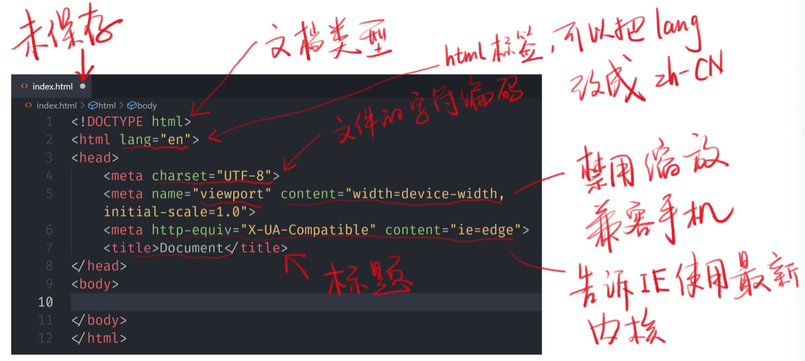

# HTML入门笔记1
## HTML历史
- Tim Berners-Lee 在1990年发明HTML
## HTML起手式

## 章节标签
> 表示文章/书的层级
- h1-h6 标题 
- section 章节 
- article 文章
- p 段落
- header 头部
- footer 脚部
- main 主要内容
- aside 旁支内容
- div 划分
## 全局属性
> 所有标签都有全局属性
- class 类别
- contenteditable 内容可编辑
- hidden 隐藏
- id 唯一标识符
- style 样式
- tabindex tab键盘导航
- title 标题
## CSS Reset
```css
* {
  margin: 0;
  padding: 0;
  box-sizing: border-box;
}
*::before,
*::after {
  box-sizing: border-box;
}
a {
  color: inherit;
  text-decoration: none;
}
input,
button {
  font-family: inherit;
}
ol,
ul {
  list-style: none;
}
table {
  border-collapse: collapse;
  border-spacing: 0;
}
```
## 内容标签
- ol + li
    - ordered list + list item
- ul + li
    - unordered list + list item
- dl + dt + dd
    - description list
        - description term + discription data
- pre
    - 预定义格式文本
- hr
    - 分隔线
- br
    - 换行
- a
    - [em与strong的区别](https://segmentfault.com/a/1190000002481725)
- *em*
    - 强调
- **strong**
    - 更强烈的强调
- code
    - 代码
- quote
    - 引用
- blockquote
    - 块引用
