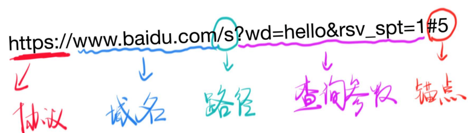

# 浅析URL
## Protocol(协议)
- HTTP
    - 规定请求的格式和响应的格式
- HTTPS
## 网络和IP
### Internet Protocal
> - 定位一台设备
> - 封装数据报文,以跟其他设备交流
```bash
ping baidu.com

### 几个特殊的IP
- 127.0.0.1 表示自己
- localhost 通过hosts指定为自己
- 0.0.0.0 不表示任何设备

## 端口
> 一台机器可以提供不同服务

- 要提供HTTP服务最好使用80端口
- 要提供HTTPS服务最好使用443端口
-要提供FTP服务最好使用21端口
- 一共有65535个端口

> [端口列表](https://zh.wikipedia.org/wiki/TCP/UDP%E7%AB%AF%E5%8F%A3%E5%88%97%E8%A1%A8)


### 规则
- 0到1023号端口是留给系统使用的
- 你只有拥有了管理员权限后,才能使用这1024个端口
- 其他端口可以给普通用户使用
- 比如http-server默认使用8080端口
- 一个端口如果被占用,就只能换一个端口哦

## 域名
> 域名就是对IP的别称
- 一个域名可以对应不同IP
    - 这个叫做负载均衡,防止一台机器扛不住
- 一个IP可以对应不同域名
    - 这个叫做共享主机,穷开发者会这么做

### DNS
> 将域名和IP对应起来
- WWW
    - www.xiedamala.com和xiedaima.com不是同一个域名
- 他们是什么关系
    - com是顶级域名
    - xiedaimala.com是二级域名(俗称一级域名)
    - www.xiedaimala.com是三级域名(俗称二级域名)
    - 他们是父子关系
    - github.io把字域名xxx.github.io免费给所有人使用
    - www.xiedaimala.com和xiedaimala.com可以不是同一家公司,也可以是
    - www是多余的
```bash
nslookup baidu.com

## 路径
> 请求不同的页面
- https://developer.mozilla.org/zh-CN/docs/Web/HTML
- https://developer.mozilla.org/zh-CN/docs/Web/CSS

### 工具
- Chrome开发者工具Network面板

## 查询参数
> 同一个页面,不同内容
- https://www.baidu.com/s?wd=hi
- https://www.baidu.com/s?wd=hello

## 锚点
> 同一个内容,不同位置
- https://developer.mozilla.org/zh-CN/docs/Web/CSS#参考书
- https://developer.mozilla.org/zh-CN/docs/Web/CSS#教程

### 注意
- 锚点看起来有中文,实际不支持中文
    - 参考书会变成
    https://developer.mozilla.org/zh-CN/docs/Web/CSS#%E5%8F%82%E8%80%83%E4%B9%A6
- 锚点无法在Network面板上看到
    - 因为锚点不会传给服务器

## URL(Uniform Resource Locator)
> 协议 + 域名/IP + 端口号 + 路径 + 查询参数 + 锚点
- 

## curl命令
> 发送HTTP请求
```bash
curl -v https://baidu.com
curl -v https://www.baidu.com
```
- 理解一下概念
    - url会被curl工具重写,先请求DNS获得IP
    - 先进行TCP连接,连接成功后,开始发送HTTP请求
    - 请求内容看一眼
    - 响应内容看一眼
    - 响应结束后,关闭TCP连接(看不出来)
    - 真正结束
